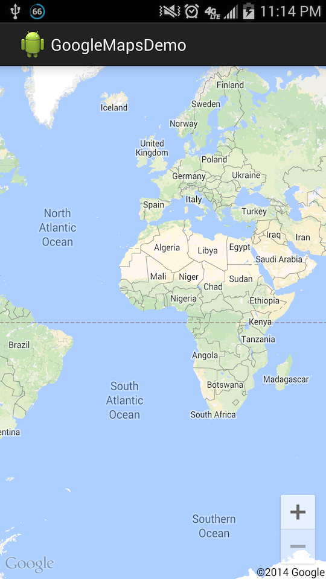

GoogleMapsDemo
==============

Simple example of implementing Google Maps API on Android using Android Studio

Tested on this environment:
Mac OS X (10.10)
Android Studio 0.8.10
Project min SDK version was API 15 (4.0.3 ICS)
Tested on my GS4 device on 4G network.

